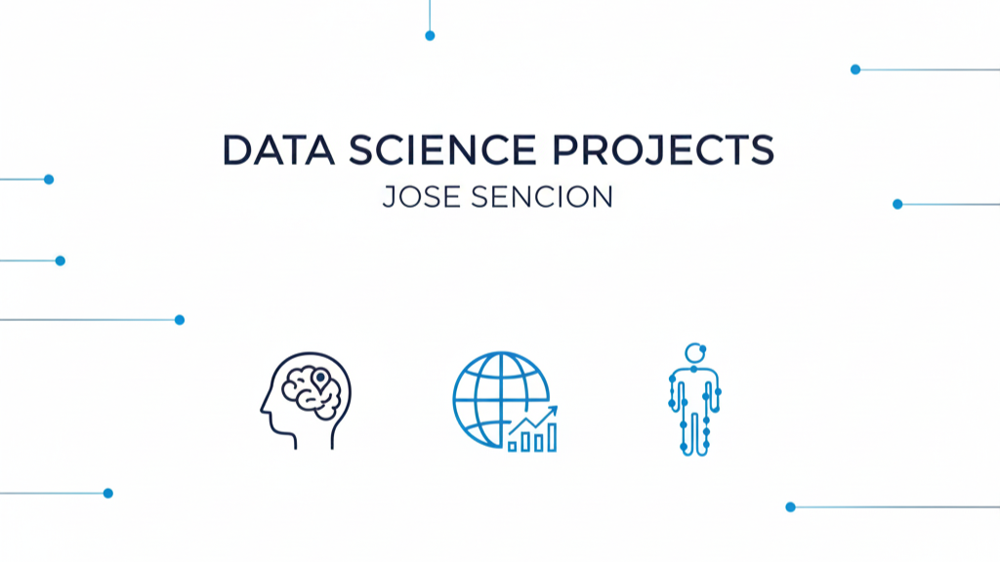
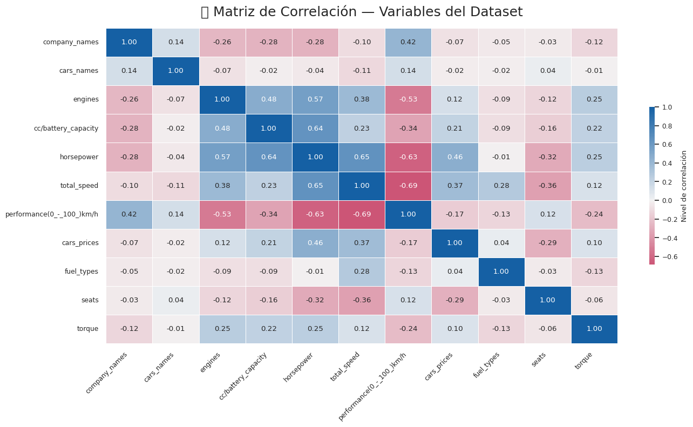
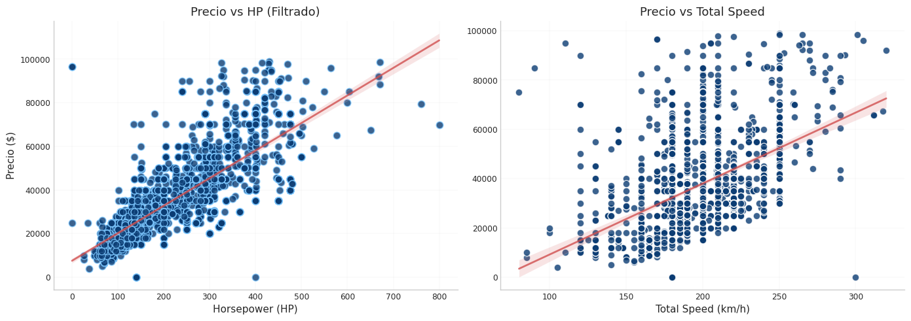
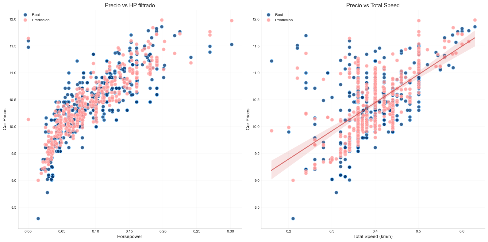

# Data-Science-Projects

  

 As a dedicated Data professional with history of meeting company goals utilizing consistent and organized
practices. Skilled in working under pressure and adapting to new situations and challenges to best enhance the
organizational brand. Experienced Data Scientist with over 5 years of experience in Tech Industry. 

## Projects
____

### 1. Cannibalization Impact Analysis from New Product Sales
____
#### Excutive Summary:

After going through multiple meetings with marketing, sales, and supply chain stakeholders, a cannibalization impact analysis was required since some key performance indicators (KPIs) were showing a downward trend, such as Net Revenue, Volume, and Net Revenue per ML or HL.

#### Setps of the Analysis:

* Data Loading
* Data cleaning and preprocessing
* Data Visualization
* Model Training and Evaluation
* Insights

#### Exploratory Data Analysis Findings:
<table style="width:100%">
<tr>
<td style="width: 49%; text-align: center; padding: 10px;">

</td>

### 2. Car's Price prediction model
____
#### Excutive Summary:

On this analysis we created a classification machine learning model to take advantage of the propability methods. In order to understand how likely is a customer to buy a car given an specific brand, model and some other specifications.

#### Setps of the Analysis:

* Data Loading
* Data cleaning and preprocessing
* Data Visualization
* Model Training and Evaluation
* Insights

#### Exploratory Data Analysis Findings:

<table style="width:100%">
<tr>
<td style="width: 49%; text-align: center; padding: 10px;">

</td>

<td style="width: 2%; border-left: 2px solid #ccc; padding: 0 5px;">
</td>

<td style="width: 49%; text-align: center; padding: 10px;">

</td>
</tr>
</table>

After going through the complex process of cleaning and preprocessing the data, we ended up with more rows because some cells contained value ranges that we split into lower and upper bounds, which effectively expanded the dataset. During this process, we also discovered important hidden variables that were categorical, such as the brand name and model of the vehicle. This led me to conclude that customers are willing to pay more for a car from a brand that is widely recognized as reliable, even when the specifications are similar to those of a cheaper option.

#### Model Training and Evaluation:
<tr>
<td style="width: 99%; text-align: center; padding: 10px;">

</td>
<td style="width: 2%; border-left: 2px solid #ccc; padding: 0 5px;">
</td>

Once we have the model results we can conclude that horsepower, speed and brand_name are the best predictors. Since we did not have enough data to create a mos accurate prediction the model performed so far good. It was performing r2 = 0.74 and once I removed the outliers it is performing 0.93 which is a 25% improvement for predictions.

